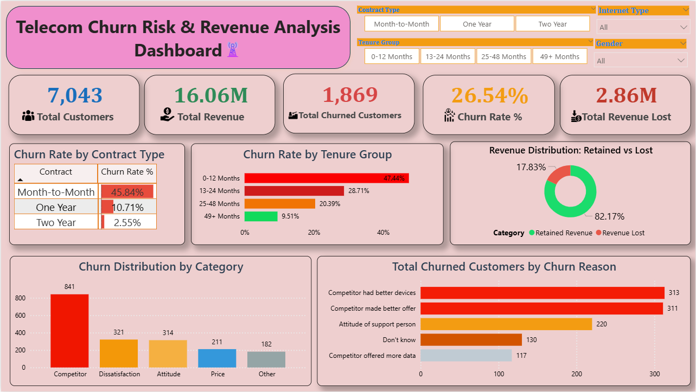

# Telecom Customer Churn Analysis Dashboard

This project analyzes customer churn in a telecom company using Python and Power BI. The aim of the project is to understand why customers leave the service, identify patterns in churn behavior, and estimate the impact of churn on company revenue.

The analysis is based on a dataset of **7,043 telecom customers**. Using Python for exploratory analysis and Power BI for visualization, the project highlights the key drivers of churn and provides insights that can help telecom companies improve customer retention.

## 📈 Dashboard Preview


---

# Problem Statement

In the telecom industry, retaining customers is important for maintaining steady revenue and long-term growth. A telecom company is experiencing customer churn, which may lead to significant revenue loss.

The objective of this analysis is to study customer behavior, understand the factors causing churn, and identify patterns that can help reduce customer loss.

---

# Project Objectives

The main goals of this project are:

* Analyze customer churn behavior using telecom customer data
* Compare customers who **stayed**, **churned**, and **joined recently**
* Identify factors such as **contract type, tenure, and monthly charges** that influence churn
* Measure the **revenue impact of churn**
* Provide insights that can help telecom companies improve retention strategies

---

# Research Questions

The analysis focuses on answering the following questions:

1. How many customers joined and how many churned during the last quarter?
2. Are churned customers different from retained customers in terms of tenure, monthly charges, and revenue?
3. Which factors such as contract type, services, or pricing are related to churn?
4. Is the company losing high-value customers?
5. What steps can the company take to reduce churn?

---

# Dataset Description

The dataset contains **7,043 telecom customer records**.

Each record includes information about:

* Customer profile
* Services used
* Contract type
* Monthly charges
* Total revenue
* Customer tenure
* Churn status

The dataset also includes churn categories and reasons, which help identify the main causes of customer churn.

---

# Important Columns Used in Analysis

Some key columns used in this project include:

* **Customer Status** – Indicates whether the customer stayed, churned, or joined
* **Tenure in Months** – Shows how long the customer stayed with the company
* **Monthly Charge** – Monthly payment made by the customer
* **Total Revenue** – Total revenue generated from the customer
* **Contract Type** – Month-to-month, one-year, or two-year contracts
* **Churn Category** – Broad reason for churn
* **Churn Reason** – Specific reason for leaving the service

These variables were used to analyze customer behavior and identify churn patterns.

---

# Tools and Technologies Used

Python
Pandas
NumPy
Matplotlib
Seaborn
Jupyter Notebook
Power BI

Python was used for **data cleaning and exploratory analysis**, while Power BI was used to build an **interactive dashboard for business insights**.

---

# Project Workflow

The project was completed in the following steps:

1. Import required libraries
2. Load telecom customer dataset
3. Perform initial data inspection
4. Clean and preprocess the dataset
5. Conduct exploratory data analysis (EDA)
6. Identify churn drivers and revenue patterns
7. Build a Power BI dashboard to visualize insights

---

# Key Insights

Some important observations from the analysis include:

* A large portion of churn occurs among customers with **month-to-month contracts**
* Customers with **short tenure are more likely to churn**
* Certain service and pricing factors contribute to customer dissatisfaction
* Churn can significantly affect **revenue and customer lifetime value**

These findings highlight areas where telecom companies can improve their retention strategies.

---

# Dashboard Features

The Power BI dashboard includes:

* Overall customer churn rate
* Revenue impact of churn
* Customer tenure analysis
* Contract type comparison
* Top reasons for customer churn

The dashboard helps stakeholders quickly identify high-risk customer groups.

---

# Repository Structure

```
Telecom-Customer-Churn-Analysis
│
├── Telecom_Customer_Churn_Analysis.ipynb
│    
│
├──  Telecom_Churn_Dashboard.pbix
│  
│
├── telecom_customer_churn.csv
│   
│
├── dashboard_preview.png
│   
│
└── README.md
```

---

# Conclusion

The analysis shows that contract type, tenure, and service factors play an important role in customer churn. Customers with flexible contracts and shorter tenure are more likely to leave.

Understanding these patterns can help telecom companies design better retention programs, improve customer experience, and reduce revenue loss caused by churn.

---

## Copyright

© 2026 Navin Bohara. All rights reserved.

This project and its contents are my original work. The code, analysis, and visualizations in this repository may not be copied, modified, or redistributed without permission.

